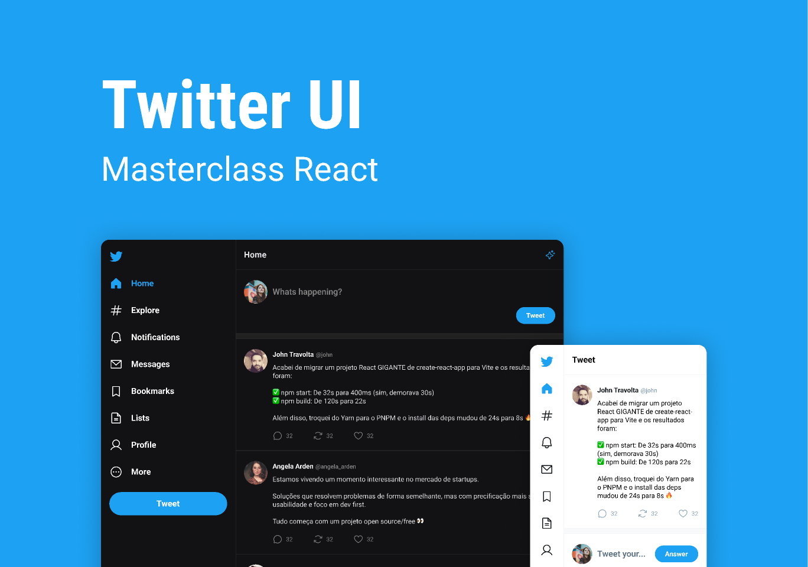

<h1 align="center"> Twitter UI </h1>

<p align="center">
 Masterclass de React é um evento exclusivo e gratuito, promovido pela Rocketseat para ensino de tecnologias WEB. <br/>
</p>

<p align="center">
  <a href="#-tecnologias">Tecnologias</a>&nbsp;&nbsp;&nbsp;|&nbsp;&nbsp;&nbsp;
  <a href="#-funcionalidades">Funcionalidades</a>&nbsp;&nbsp;&nbsp;|&nbsp;&nbsp;&nbsp;
  <a href="#-layout">Layout</a>&nbsp;&nbsp;&nbsp;|&nbsp;&nbsp;&nbsp;
  <a href="#memo-licença">Licença</a>
</p>

<p align="center">
  
</p>

<br>

<p align="center">
  
</p>

## 🚀 Tecnologias

Esse projeto foi desenvolvido com as seguintes tecnologias:

- HTML e CSS
- JavaScript
- TypeScript
- React (react-dom | react-router-dom)
- Figma

## 💻 Funcionalidades:

- [x] Registro de usuário
- [x] Criação de Tweet
- [x] Comentar o Tweet
- [x] Mensagens diretas
- [x] Retweet

## 🔖 Layout

Você pode visualizar o layout do projeto através [DESSE LINK](https://www.figma.com/community/file/1202694130789327431/Twitter-UI). É necessário ter conta no [Figma](https://figma.com) para acessá-lo.

## 🚀 Instalação e uso

```bash
# Clone o repositório
git clone https://github.com/Alexandre-Schmidt/TwitterUI.git

# Acesse a pasta do projeto
cd TwitterUI

# Instale as dependências
npm install

# Execute a aplicação
npm run dev

# O servidor inciará na porta:3000 - acesse http://localhost:3000
```

## :memo: Licença

Esse projeto está sob a licença MIT.

---

:wave: Confira meu perfil profissional no [LinkedIn](https://www.linkedin.com/in/alexandreborgesschmidt/)
